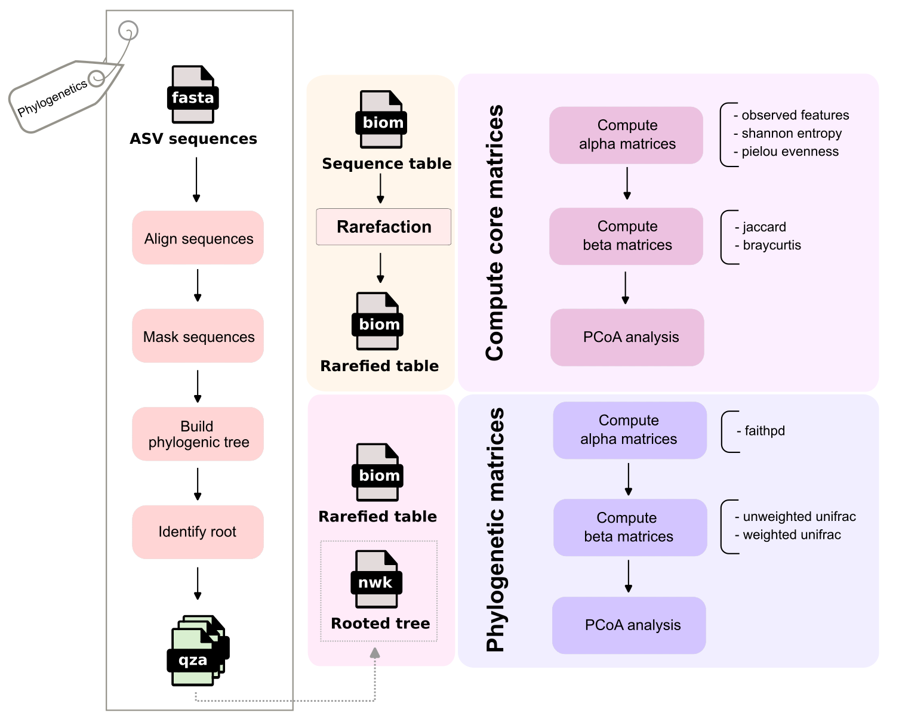
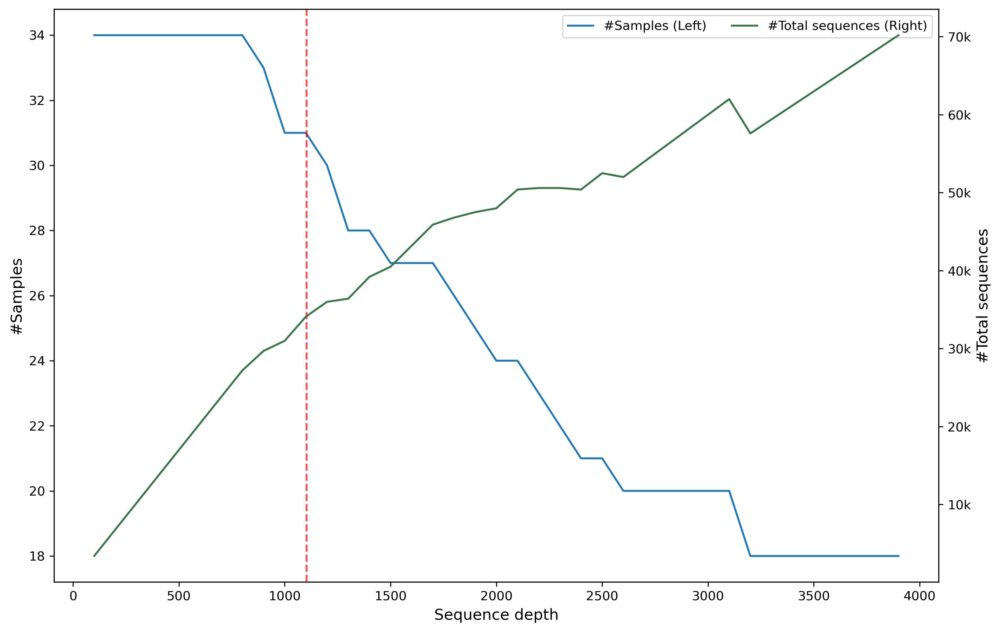

# Diversity analysis

## Introduction

Microbes have a profound impact on human life, influencing the environment, health, disease, and ecosystems. Understanding the diversity and composition of these ecological units is fundamental to answering broader ecological questions [@cassolKeyFeaturesGuidelines2025].

Depending on the scale of the ecological units, diversity is measured at three levels [@andermannEstimatingAlphaBeta2022].

  - **Alpha diversity**: Describes the richness and evenness within a single community.
  - **Beta diversity**: Analyzes the differentiation between distinct communities.
  - **Gamma diversity**: Studies diversity at a larger landscape or geographic scale.

In the QIIME 2 tutorial, the focus is on alpha and beta diversity. The subsequent steps involve constructing a phylogenetic tree and generating core metrics matrices to facilitate these analyses.

Command for creating phylogenetic tree:
```bash
qiime phylogeny align-to-tree-mafft-fasttree \
  --i-sequences rep-seqs.qza \
  --o-alignment aligned-rep-seqs.qza \
  --o-masked-alignment masked-aligned-rep-seqs.qza \
  --o-tree unrooted-tree.qza \
  --o-rooted-tree rooted-tree.qza
```

Generating matrices:
```bash
qiime diversity core-metrics-phylogenetic \
  --i-phylogeny rooted-tree.qza \
  --i-table table.qza \
  --p-sampling-depth 1103 \
  --m-metadata-file sample-metadata.tsv \
  --output-dir diversity-core-metrics-phylogenetic
```

## Workflow



The output from the [DADA2 algorithm](dada2.md), "ASV sequences", is utilized to compute a rooted phylogenetic tree at the [](#phylogenetics) step. Meanwhile the Sequence table (BIOM count table of ASVs $\times$ samples, also generated by DADA2) is stardardized via [](#rarefraction). This rarefied table is then used to compute [core matrices](#core-matrices) (non-phylogenetic) and integrated with the rooted tree to calculate [phylogenetic matrices](#phylogenetic-matrices).  

(phylogenetics)=
### Phylogenetics

The ASV sequences generated by the [DADA2 algorithm](dada2.md) are aligned using MAFFT v7.526 [@katohMAFFTMultipleSequence2013]. By default, the progressive `FFT-NS-2` method is employed. In this workflow, a distance matrix is calculated based on shared 6-tuples between pairs of sequences, and a phylogenetic guide tree is constructed using the UPGMA method prior to performing the Multiple Sequence Alignment (MSA).

Following the MSA step, positions are masked to retain if satisfying the gap frequency is $\le 1.0$ and the frequency of the most prevalent character (not include gaps) is $\ge 0.4$ (default thresholds).

Using the MSA, FastTree v2.2.0 [@priceFastTree2Approximately2010] generates an initial unrooted tree via a heuristic Neighbor-Joining (NJ) method. Nearest-Neighbor Interchanges (NNIs) are then employed to explore alternative topologies and branch lengths. These candidate trees serve as the basis for Maximum Likelihood (ML) computations, which statistically estimate the most likely topology and branch lengths to produce the final phylogenetic tree.

Finally, the workflow utilizes the Midpoint Rooting (MPR) method [@farris1972estimating], implemented in the [scikit bio](https://scikit.bio/docs/latest/generated/skbio.tree.TreeNode.root_at_midpoint.html#skbio.tree.TreeNode.root_at_midpoint) package, to restructure the tree and determine the root. The algorithmic implementation can be referenced in [MPR.py](https://github.com/Truongphi20/qiime2_blog/tree/main/algorithm_reference/MPR.py).

(rarefraction)=
### Rarefaction

Before computing core matrices, the abundance table is randomly subsampled (rarefied) to ensure the total number of sequences across all ASVs in each sample is exactly 1103 (`--p-sampling-depth`). Samples are discarded if their total sequence count is below this threshold.



Note: The red dash line is the threshold 1103.

As the rarefaction threshold increases, the number of retained samples decreases, while the total sequence count increases due to the greater contribution from highly abundant samples.

Setting the threshold too low results in insufficient data for a robust analysis. Conversely, setting it too high leads to the elimination of too many samples, reducing statistical power. The goal is to select a threshold that retains as many samples as possible while capturing a "large enough" number of sequences to represent the community. This critical step ensures evenness and comparability across all samples in the study.

(core-matrices)=
### Computation of core matrices

The refied feature table is used to calculate core matrices:
  - **Alpha matrices:** Measure diversity within individual samples (*observed feature, shannon entropy, pielou evenness*)
  - **Beta matrices:** Compute dissimilarity matrices, containing distance between pairs of samples (*jaccard, bray curtis*)

| Matrix name |  Meaning   |   Calculation method   |    References   |
| :---------  | :--------- | :-------------------   |:---------------|
| observed feature | Measures the **richness** (count) of unique ASVs present. | $S_{\text{obs}} = n$ <br> ([observed_features.py](https://github.com/Truongphi20/qiime2_blog/blob/main/algorithm_reference/observed_features.py))   |  |
| shannon entropy  | Measures the **complexity** in each sample  | $H = -\sum{p_i \times log_2(p_i) }$, ([shannon_entropy.py](https://github.com/Truongphi20/qiime2_blog/blob/main/algorithm_reference/shannon_entropy.py))  | [@shannon1948mathematical] |
| pielou evenness  | Measures the **normalized complexity** (evenness of abundance) in each sample      | $J = -\sum p_i \times \log_n(p_i)$, ([pielou_evenness.py](https://github.com/Truongphi20/qiime2_blog/blob/main/algorithm_reference/pielou_evenness.py))      |    [@pielou1966measurement] |
| jaccard          | Computes dissimilarity of **richness** across pairs of samples        |  See [the method](https://docs.scipy.org/doc/scipy/reference/generated/scipy.spatial.distance.jaccard.html),  <br> ([jaccard.py](https://github.com/Truongphi20/qiime2_blog/blob/main/algorithm_reference/jaccard.py))                     | [@jaccard1908nouvelles]    |
| bray curtis      |  Computes dissimilarity of **relative abundance distribution** across pairs of samples  |  See [the method](https://docs.scipy.org/doc/scipy/reference/generated/scipy.spatial.distance.braycurtis.html), <br> ([braycurtis.py](https://github.com/Truongphi20/qiime2_blog/blob/main/algorithm_reference/braycurtis.py))    | [@bray1957ordination]      |

Note: 

- $p_i$: The relative abundance (probability) of $\text{ASV}_i$ in a sample, where $p_i = \frac{\text{\#ASV}_i}{\text{\#total sequences}}$. (\#total_sequences is 1103 in our case)
- $n$: The total number of observed ASVs in the sample.  

At the end, the beta diversity (distance) matrices, jaccard and bray curtis, are utilized to calculate principal coordinates through Principal Coordinates Analysis (PCoA) [@gower1966some]. This dimensionality reduction technique projects the multi-dimensional distance data into a lower-dimensional space, typically visualized as 2D or 3D plots to reveal ecological patterns.

(phylogenetic-matrices)=
### Computation of phylogenetic matrices

While alpha diversity matrices quantify the richness and abundance of a community, they fail to account for the evolutionary relationships among ASVs. 

For instance, consider a scenario where Sample A contains more unique ASVs than Sample B. If all ASVs in Sample A share extremely high sequence similarity, it is difficult to argue that Sample A is truly more diverse than Sample B in a biological sense.

The problem are addressed by phylogenetic matrices, includes:
  - **Alpha matrices:** faithpd
  - **Beta matrices:** unweighted_unifrac and weighted_unifrac

| Matrix name |  Meaning   |   Calculation method   |    References   |
| :---------  | :--------- | :-------------------   |:--------------- |
| faithpd     | Measures total phylogenetic distance among ASVs in each sample. | See [the method](https://scikit.bio/docs/dev/generated/skbio.diversity.alpha.faith_pd.html), <br> ([faithpd.py](https://github.com/Truongphi20/qiime2_blog/blob/main/algorithm_reference/faithpd.py))                       | [@faith1992conservation]  |
| unweighted_unifrac | Computes proportion of phylogenetical dissimilarity across pairs of samples | The ratio of unique branch lengths (exclusive to one sample) over the total branch lengths (union of both samples), <br> ([unweighted_unifrac.py](https://github.com/Truongphi20/qiime2_blog/blob/main/algorithm_reference/unweighted_unifrac.py))     | [@sfiligoi2022optimizing] |
| weighted_unifrac   |  Computes the phylogenetic distance according to the ralative abundance across pairs of samples         | The sum of branch lengths weighted by the absolute difference in abundance proportions between two samples, <br> ([weighted_unifrac.py](https://github.com/Truongphi20/qiime2_blog/blob/main/algorithm_reference/weighted_unifrac.py))          | [@sfiligoi2022optimizing] |

Similar to the [non-phylogenetic core matrices](core-matrices), the distance matrices generated via unweighted and weighted UniFrac are used as inputs for PCoA.

## Summary

Identifying the root of the phylogenetic tree is a mechanical necessity for diversity analysis. Faith’s PD requires a directed hierarchy to accumulate branch lengths from successors up to the common ancestor (see the algorithmic code). Furthermore, a rooted tree provides the fixed reference points needed to calculate meaningful shared and unique evolutionary branch lengths between samples in UniFrac matrices.

During this deep dive, I also noticed that MAFFT suspiciously "picks out" specific conserved nucleotide positions in the ASV sequences after MSA (see my [MAFFT issue](https://github.com/Truongphi20/qiime2_blog/issues/10)).

Ultimately, while non-phylogenetic (core) matrices treat every ASV as an independent entity, phylogenetic matrices leverage the shared evolutionary history encoded within the sequences to provide a deeper biological context.