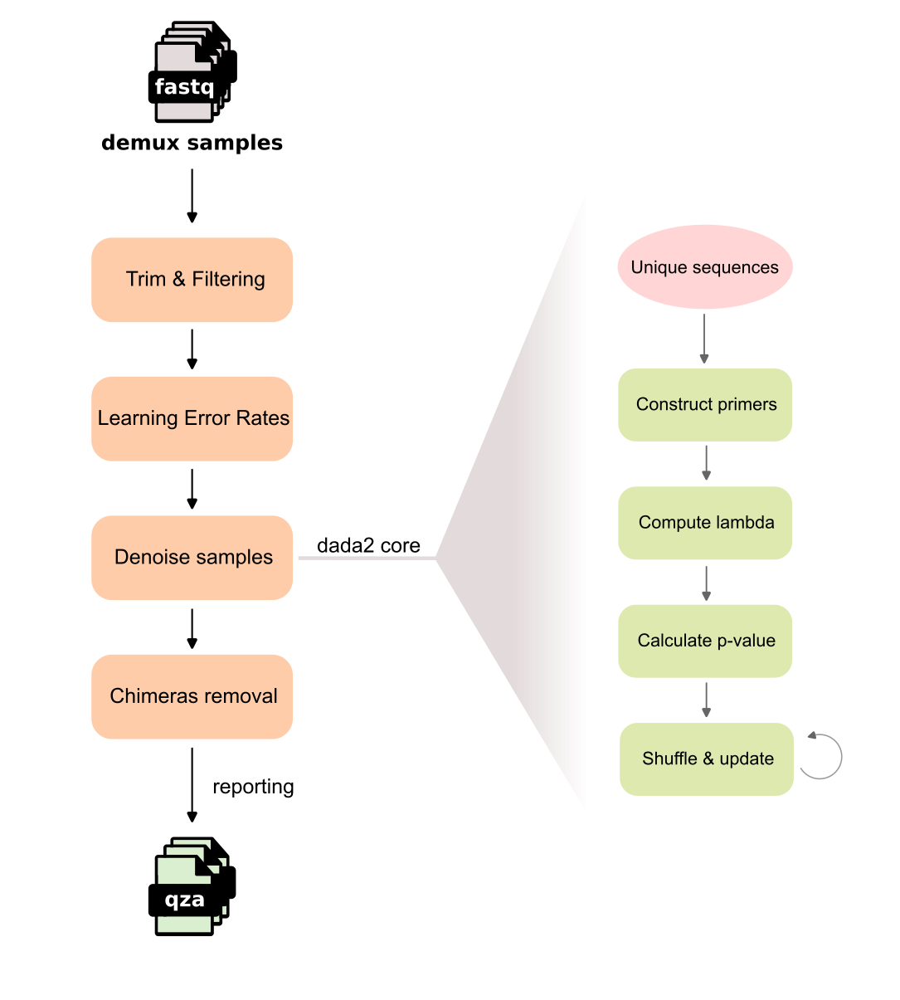

# DADA2

## Introduction

In 16S rRNA analysis, the first step in characterizing the microbiome of a sample is to cluster similar sequencing reads into representative units that can be used for taxonomic assignment. However, sequencing errors can introduce false positives, leading to incorrect biological interpretations. Traditionally, this clustering is performed by grouping reads into Operational Taxonomic Units (OTUs) based on a fixed sequence dissimilarity threshold. Nevertheless, this approach often lacks sufficient resolution to capture fine-scale taxonomic variation and can result in misinterpretation of microbial diversity [@callahanDADA2HighresolutionSample2016].   

DADA2 and other “denoising” tools address this issue by attempting to correct sequencing errors at the single-nucleotide level without constructing OTUs. Instead, they generate Amplicon Sequence Variants (ASVs) [@nearingDenoisingDenoisersIndependent2018].

In "Moving Pictures" tutorial, DADA2 is a denoising option after demultiplex, the command:

```bash
qiime dada2 denoise-single \
  --i-demultiplexed-seqs demux.qza \
  --p-trim-left 0 \
  --p-trunc-len 120 \
  --o-representative-sequences rep-seqs.qza \
  --o-table table.qza \
  --o-denoising-stats denoising-stats.qza \
  --o-base-transition-stats base-transition-stats.qza

```

With `demux.qza` is the output of demultiplex obtaining fastq files of each sample. 

## Workflow



The workflow begins with demultiplexed FASTQ samples undergoing [](#trim-filtering) to remove low-quality data, followed by [](#learning-error-rates) to estimate error rate between unique sequence and their partition center sequence (the most abundant in a variant group).

The process then enters the [](#denoise-samples) stage (the "DADA2 core") where a specialized algorithm performs constructing priors from unique sequences, and calculating p-values to distinguish and remove sequencing noise from biological variants. 

Once the samples are denoised, the pipeline handles [](#chimeras-removal) to eliminate chimeras (unique sequence belongs two or more partition center sequence) before reporting the final results as artifacts for downstream analysis.

(trim-filtering)=
### Trim & Filtering


(learning-error-rates)=
### Learning Error Rates


(denoise-samples)=
### Denoise samples


(chimeras-removal)=
### Chimeras Removal

