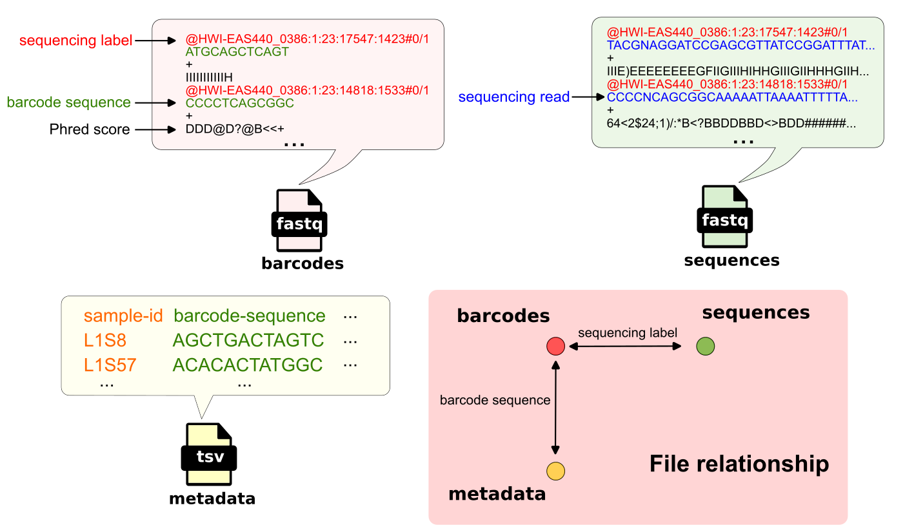

# Demultiplexing

## Introduction

"Multiplexing" is a sequencing technique, which pools many samples in the same sequecning batch, where samples are distinguished by barcode sequences. It helps enhance throughput, optimize cost, and simplifiy analysis [@SampleMultiplexingMultiplex]. In contrast, "demultiplexing" resolves that which sample that sequencing read belonging. 

The command in the tutorial:
```bash
qiime demux emp-single \
  --i-seqs emp-single-end-sequences.qza \
  --m-barcodes-file sample-metadata.tsv \
  --m-barcodes-column barcode-sequence \
  --o-per-sample-sequences demux.qza \
  --o-error-correction-details demux-details.qza
```

There are two main inputs for this process:
    
- `emp-single-end-sequences.qza`: Including fastq files of barcode and sequencing read.
- `sample-metadata.tsv`: Metatdata contains auxiliary information according to barcode. 



Base on the sequencing label on a read (in sequences fastq file), the original sample (in metadata) is retrieved by the barcode associating the same the sequencing label (in barcodes fastq file).  

## Demultiplex workflow

```{image} static/demux_workflow.png
:alt: demux_workflow
:height: 600px
:align: center
```

Sequencing reads are processed one by one from the input FASTQ file. For each read, the associated barcode sequence is retrieved. Although, the step "Reverse complement barcode" was not performed in this command (`demux emp-single`), more information can be found in [](#reverse-complement).

Next, Golay error correction is applied by default to the barcode, allowing correction of sequencing errors in barcode sequence (up to three mismatches) and improving robustness in sample identification (read more in [](#golay-correct)). 

The corrected barcode is then matched against a predefined barcode-to-sample mapping. If a match is found, the corresponding read is assigned to that sample and written to its output FASTQ file. Reads that do not match any known barcode are discarded. 

Over the course of processing, reads are thus separated into multiple per-sample FASTQ files, each representing an individual sample from the original multiplexed dataset.

(reverse-complement)=
## Reverse complement barcode

Reverse complementing is required when barcode sequences in the reads are in the opposite orientation to those in the metadata mapping file, which can occur depending on sequencing setup (e.g., Illumina index reads). If not corrected, this mismatch can result in failed or low-rate sample assignment.

QIIME 2 provides two options to handle this:

- `--p-rev-comp-barcodes`: reverse complements the barcodes extracted from sequencing reads. Use this when the reads are misoriented relative to the mapping file.  
- `--p-rev-comp-mapping-barcodes`: reverse complements the barcodes in the metadata mapping file. Use this when the mapping file is misoriented relative to the reads.  

Only one option should be used, depending on which side has incorrect orientation.

(golay-correct)=
## Golay error correction

Golay error correction is an error-correcting coding method that represents DNA barcodes as structured 24-bit vectors, enabling detection and correction of sequencing errors based on the properties of the Golay (24,12,8) code [@morelos-zaragozaArtErrorCorrecting2006, pg.30-31]. It is used in sequencing workflows to improve sample assignment accuracy. Because sequencing errors are common, exact barcode matching can lead to substantial data loss. 

Golay coding allows correction of maximal three bit errors, depending on type of correction, the number of bit changed is different. If the the number od bit errors exceeds three, the record is discarded.  

| Correction    |   Number of bit changed  |
| :----------    |   :---------------------:  |
| A $\xleftrightarrow{}$ T |  1              |
| C $\xleftrightarrow{}$ G |  1              |
| {A,T} $\xleftrightarrow{}$ {C,G} |  2              |

**Correction workflow:**
1. Convert barcode (DNA) to a 24-bit vector (2 bits per nucleotide)  
2. Compute the syndrome using a parity-check matrix \(H\)  
3. Use the syndrome to identify the most likely error pattern (lookup table)  
4. Correct the bit vector by applying the error pattern  
5. Convert the corrected bits back to a DNA sequence  

Golay error correction assumes that true barcodes belong to the predefined set of valid Golay codewords ($2^{12} = 4096$ valid barcodes), that barcodes have a fixed length of 12 nucleotides (corresponding to 24-bit codewords), that sequencing errors are limited (typically no more than three bit errors), and that these errors occur randomly rather than systematically.

Full python script for Golay error correction can be found in [GolayDecoder.py](https://github.com/Truongphi20/qiime2_blog/blob/demultiplex/algorithm_reference/GolayDecoder.py).