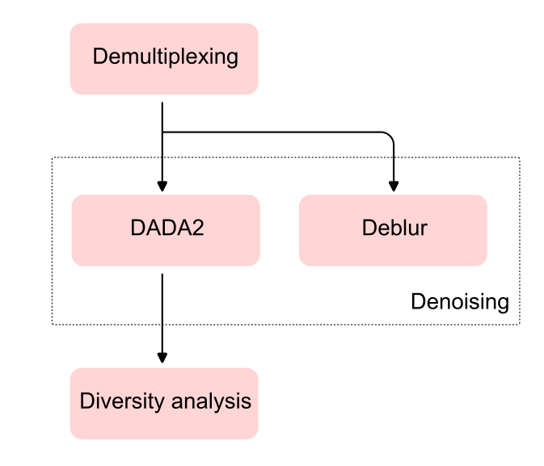

# QIIME2 Under the Hood

## Motivation

The QIIME 2 [Moving Pictures tutorial](https://amplicon-docs.qiime2.org/en/stable/tutorials/moving-pictures/) is the gold standard for newcomers to get familiar with 16S rRNA analysis. While the tutorial covers the essential steps of a basic analysis, it focuses primarily on executing commands and evaluating outputs without providing a deep look into the underlying processes.

This motivated me to create this blog: to provide a high-level abstraction of the crucial workflows operating behind the scenes of QIIME 2 commands.

## Covered content

This blog explores the internal logic and workflows of the QIIME 2 (v2026.1.0) commands featured in the tutorial: 

- [Demultiplexing](./demultiplexing.md)
- Denoising
  - [DADA2](./dada2.md)
  - [Deblur](./deblur.md) 
- [Diversity analysis](alpha-div.md)

The practiced method to complile context for this blog can be found in [Methology](./methodology.md).

:::{attention} Disclaim

I am not a member of the QIIME 2 core development team, just a curious bioinformatician wanting to understand what happens under the hood. I’ve written this blog as a reference for my future self and for anyone else sharing this curiosity. 

I greatly appreciate any contributions. If you have any questions, feel free to [create an issue](https://github.com/Truongphi20/qiime2_blog/issues/new) to discuss or open a pull request for any necessary changes.  

:::